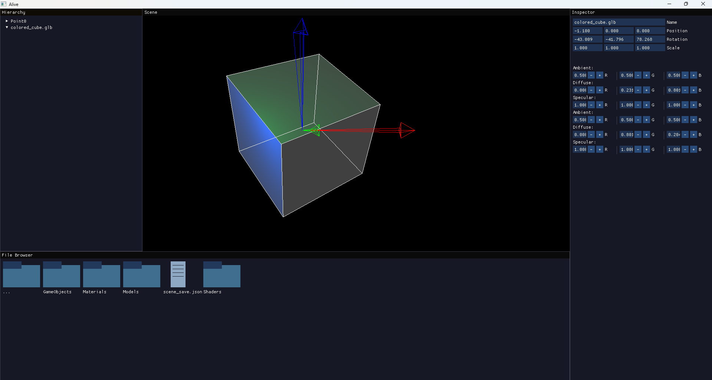

## Alive Game Engine

### Introduction
The Alive Game Engine is  a desktop application built in CPP whose purpose is to be used as a tool in which all games moving forward will be created upon. Games created with it will all have the same style as a result of this. The engine will give the developer the ability to build/import scenes, animations, implement music and sound, collision detection, basic enemy AI, and other helpful features. Currently all games are intended to only be developed for Windows OS.

### Screenshots

### Development Objective Checklist
#### Graphics
 - [x] Using OpenGL for rendering.
 - [x] Integrated GLFW for window creation and input handling.
 - [x] GLAD loader setup.
 - [x] Integrated Assimp for handling of .glb and .obj graphics files.
 - [x] Rendering objects using basic shaders.
 - [x] Implemented Phong Lighting for Rendering.
 - [x] Added visual indicators for a GameObject's bounds.
#### Design Patterns
 - [x] Singleton Design Pattern Implemented.
 - [x] Observer Design Pattern Implemented.
#### UI and Windows
 - [x] Created FileBrowserWindow, InspectorWindow, HierarchyWindow, and SceneWindow using DearImGui.
 - [x] InspectorWindow updates to display all GameObjects and Lights in the current scene.
 - [x] InspectorWindow Sub-Menu to create either a GameObject or Light. Selecting either fires a respective "Create" event.
 - [x] FileBrowserWindow has the basic functionality of going into and out of folders. Selecting a file fires an event.
 - [x] HierarchyWindow shows and allows the manipulation of the currently selected GameObject's position, rotation, and materials.
#### GameObject Management
 - [x] Created GameObject Class.
 - [x] Implemented individual object properties:
-   Each object has:
    - [x]  Unique ID
    - [x]  Name
    - [x] Transform (as a separate class)
    - [x] Mesh (as a separate class)
    - [x] Bounding box (as a separate class)
    - [x] Tags (Vector of Enum)
- [x] Transform, Mesh, and BoundingBox classes can be created and used independently of `GameObject`.
- [x] GameObjects hold references to both its parents and children through pointers.
- [x] GameObjects can be saved and loaded.
#### Scene Management
- [x] Singleton SceneManager created.
- [x] References for currentScene added.
- [x] Scene Class holds references to the GameObjects and Lights currently in it.
- [x] Scenes can be saved and loaded.
- [x] GameObjects and Lights can be managed through the Scene.
#### Event System
- [x] EventManager Class setup using the Observer and Singleton patterns.
#### Raycasting
- [x] Implemented camera raycasts.
